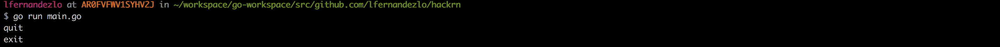
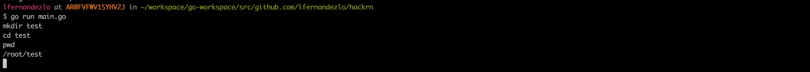
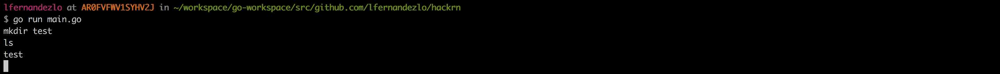
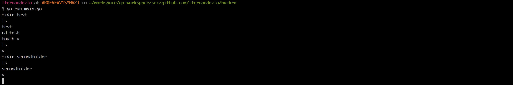
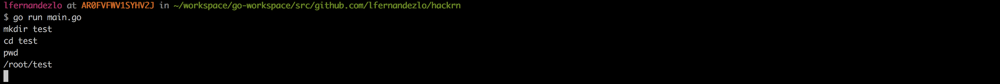
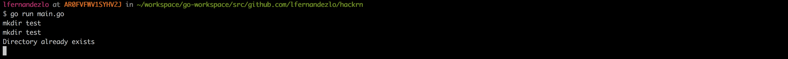
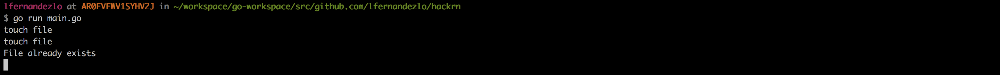
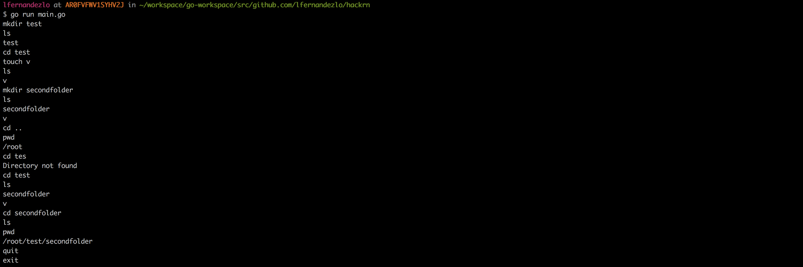

## Table of contents
- [Summary](#summary)
- [Author](#author)
- [Dependencies](#dependencies)
- [Application start](#application%20start)
- [Commands](#commands)
  - [Quit](#quit)
  - [Cd](#cd)
  - [Ls](#ls)
  - [Pwd](#pwd)
  - [Mkdir](#mkdir)
  - [Touch](#touch)
- [Errors](#errors)
- [Complete Example](#complete%20example)

## Summary
- This exercise simulates a command line shell. It does not actually create any objects on physical disk. Instead, it maintains objects and state within the context of the running application.

## Author
- Fernandez Losavio, Luka (lfernandezlosavio@gmail.com)

## Application start
- Clone project in your $GOPATH and run using `go run main.go`. To install GOLANG check [URL](https://golang.org/doc/install).

## Dependencies

- Used [go dep](https://golang.github.io/dep) as dependency manager. And [stretchr/testify](https://github.com/stretchr/testify) for tests.

## Commands
- Available commands are `QUIT`,`CD`,`LS`,`PWD`,`MKDIR`,`TOUCH`

### Quit
- Terminates the program printing `exit`

#### Input
```json
quit
```

#### Output
```json
exit
```

#### IMG



### CD
- This command changes current path to a sub directory (if exits), if not "Directory not found" message will be displayed. The command also accepts `..` for returning to previous folder

#### Input
```json
cd test
```

#### IMG



### LS
- This command lists the contents (directories and files) of the current directory. It writes a single item per line. If there are no items, nothing will be printed.

#### Input
```json
ls
```

#### IMG



- File and folder



#### Output
```json
folder
secondfolder
file
secondfile
```

### PWD
- This command prints full path of current directory

#### Input
```json
pwd
```

#### Output
```json
/root/folder
```

#### IMG




### MKDIR
- This command "creates" a directory under current directory. Character limit of 100. If directory already exists "Directory already exits" message will be printed

#### Input
```json
mkdir folder
```

#### IMG




### TOUCH
- This command "creates" a file under current directory. Character limit of 100.

#### Input
```json
touch file
```

#### IMG




### Errors

- Defined exercise errors are:
  - `Invalid File or Folder Name` returned by `TOUCH` or `MKDIR`. Error will occur when trying to create a folder or file with character length major to 100.
  - `Directory already exists` returned by `MKDIR`. Error will occur when trying to create an already existent directory.
  - `Directory not found` returned by `CD`. Error will occur when trying to navigate to unexistent directory.
  - `File already exists` returned by `TOUCH`. Error will occur when trying to create an already existent file.
  - `Already on root folder` special case of `CD`. Error will occur on `..` param when cmd it is already on root folder.


### Complete example

